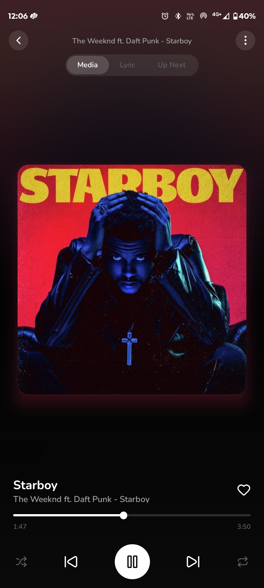

<div align="center">
  

  # 🍒 GROOVLI
  ### **MUSIC REIMAGINED**
  *A high-performance, minimalist music player experience.*

  [](https://reactnative.dev/)
  [](https://expo.dev/)
  [](https://www.typescriptlang.org/)
  [](https://vitejs.dev/)

</div>

---

## 🌟 Overview

**Groovli** is a state-of-the-art music player built with performance and aesthetics at its core. Designed for the modern era, it strips away the clutter of traditional streaming apps to provide a focused, high-fidelity listening experience.

### 🔗 [GitHub Repository](https://github.com/Shyamkano/groovli-app)
### 📱 [Download the latest APK](src/apk%20file/Groovli%20app.apk)

---

## ✨ Key Features

- **🔍 Global Search**  
  Instant access to millions of tracks worldwide. No accounts, no boundaries.
- **🎧 Zero Interruptions**  
  Pure audio focus. No ads, no tracking, just you and your favorite playlist.
- **⚡ Performance Oriented**  
  Optimized React Native state management ensures 60fps interaction and <0.4s search latency.
- **🎨 Premium Aesthetics**  
  A minimalist cherry-themed UI designed for focus and modern music lovers.
- **🏷️ Smart Discovery**  
  Find your next obsession with intelligent artist tagging and album navigation.

---

## 📸 Screenshots

<div align="center">
  
</div>

---

## 🛠️ Technology Stack

- **Mobile Application**: React Native + Expo Core
- **Landing Page**: Vite + React + Tailwind CSS
- **Programming Language**: TypeScript
- **Animations**: Framer Motion
- **Icons**: Lucide Icons
- **Performance**: High-Fi Audio Engine

---

## 🚀 Getting Started

### **Experience the Landing Page**
To run the project's recruitment/landing page locally:

1. **Clone the repository**
2. **Install dependencies**
   ```bash
   npm install
   ```
3. **Launch development server**
   ```bash
   npm run dev
   ```

### **Install the App**
To install the Groovli music player on your Android device:
1. Locate the APK in `src/apk file/`.
2. Transfer the `Groovli app.apk` to your device or download it directly.
3. Open the file and follow the installation prompts.

---

## 🤝 Contributing

Contributions are what make the open source community such an amazing place to learn, inspire, and create. Any contributions you make are **greatly appreciated**.

1. Fork the Project at [https://github.com/Shyamkano/groovli-app](https://github.com/Shyamkano/groovli-app)
2. Create your Feature Branch (`git checkout -b feature/AmazingFeature`)
3. Commit your Changes (`git commit -m 'Add some AmazingFeature'`)
4. Push to the Branch (`git push origin feature/AmazingFeature`)
5. Open a Pull Request from your fork.

---

## 📄 License
© 2026 **GROOVLI MUSIC PROJECT**  
Licensed under the [MIT License](LICENSE). 

<div align="center">
  <sub>Made with ❤️ for the music community</sub>
</div>

